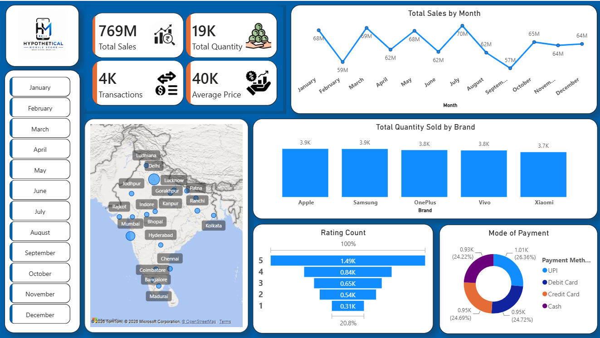

# 📱 Smartphone Sales Analysis Dashboard | Power BI

## 📌 Project Overview

The **Smartphone Sales Analysis Dashboard** is an interactive Power BI project created to analyze smartphone sales data and present business insights in a simple and visually appealing way. The dashboard helps understand sales performance, customer purchasing patterns, brand popularity, and regional sales distribution.

The objective of this project is to transform raw sales data into meaningful insights that can support business decisions through interactive reports and visualizations.

---

## 🎯 Objectives

- Analyze overall smartphone sales performance.
- Track monthly sales trends.
- Compare sales quantity across different smartphone brands.
- Identify high-performing cities based on sales.
- Understand customer ratings.
- Analyze preferred payment methods.
- Build an interactive dashboard for easy data exploration.

---

## 📊 Dashboard Overview

### 1. KPI Cards

The dashboard displays four key business metrics at the top:

- **Total Sales**
- **Total Quantity Sold**
- **Total Transactions**
- **Average Selling Price**

These KPIs provide a quick summary of the overall business performance.

---

### 2. Monthly Sales Trend

A line chart shows total sales for each month, making it easy to identify seasonal trends, peak sales periods, and months with lower performance.

**Business Insight:**
- Compare monthly revenue.
- Identify growth or decline in sales.
- Monitor sales consistency throughout the year.

---

### 3. Brand-wise Quantity Sold

A column chart compares the total number of smartphones sold for each brand.

Brands included:
- Apple
- Samsung
- OnePlus
- Vivo
- Xiaomi

**Business Insight:**
- Identify top-selling brands.
- Compare market demand across different manufacturers.

---

### 4. Sales Distribution by City

A map visualization displays sales across different cities in India.

**Business Insight:**
- Locate high-performing markets.
- Understand geographical sales distribution.
- Support regional business planning.

---

### 5. Customer Rating Analysis

A funnel chart represents the distribution of customer ratings from 1 to 5.

**Business Insight:**
- Measure customer satisfaction.
- Analyze rating patterns.
- Identify overall product reception.

---

### 6. Payment Method Analysis

A donut chart shows the distribution of payment methods used by customers.

Payment methods include:

- UPI
- Debit Card
- Credit Card
- Cash

**Business Insight:**
- Understand customer payment preferences.
- Support future payment strategy decisions.

---

### 7. Interactive Month Filter

The dashboard includes a month slicer that allows users to filter the entire report by selecting any month.

This enables quick comparison of sales performance across different time periods.

---

## 🛠 Tools & Technologies

- **Power BI Desktop**
- **Power Query**
- **DAX (Data Analysis Expressions)**
- **Data Modeling**

---

## 📈 Key Insights

- Overall business performance can be monitored using KPI cards.
- Monthly trends help identify peak and low sales periods.
- Brand comparison highlights the most popular smartphone brands.
- City-wise visualization shows regions with higher sales activity.
- Customer ratings provide an overview of customer satisfaction.
- Payment method analysis reveals customer transaction preferences.

---

## 📷 Dashboard Preview

## 📌 Conclusion

This dashboard demonstrates how Power BI can be used to transform raw smartphone sales data into meaningful business insights. By combining interactive visuals with key performance metrics, the dashboard provides a clear overview of sales performance, customer behavior, and market trends. It serves as a practical example of business intelligence and data visualization, making it easier for users to explore data and support informed decision-making.
